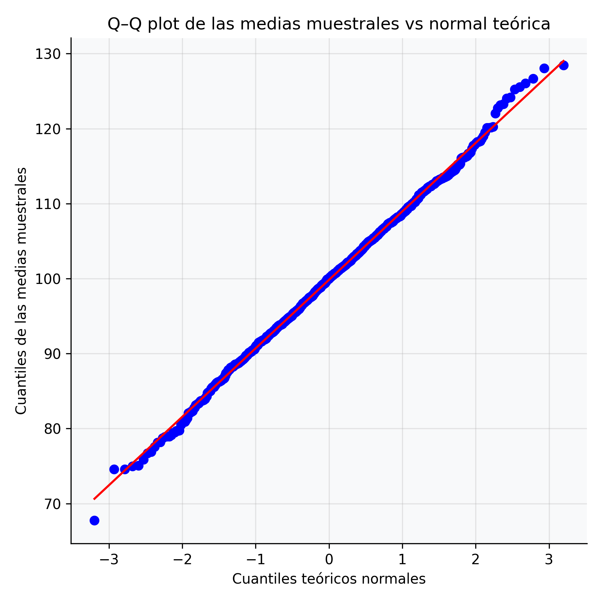
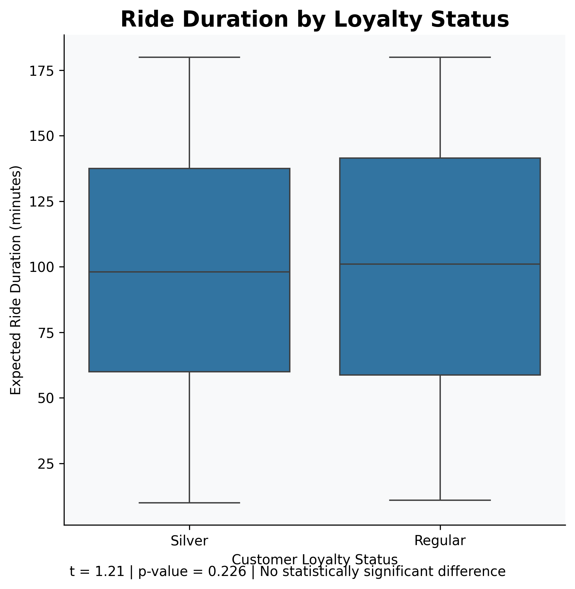
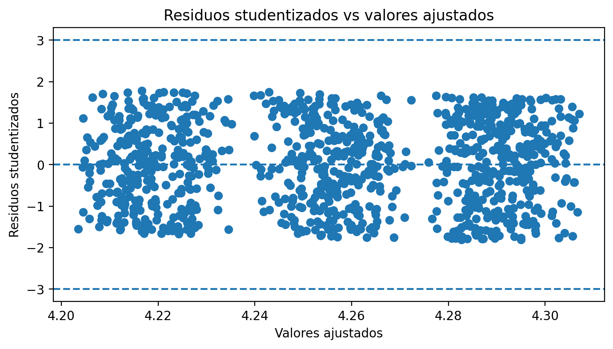
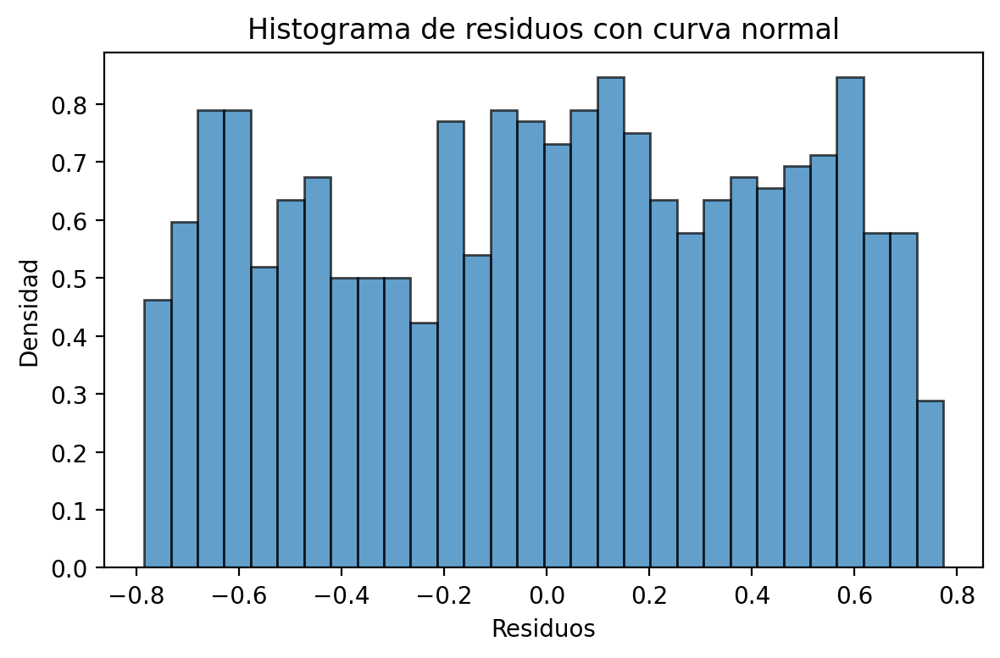
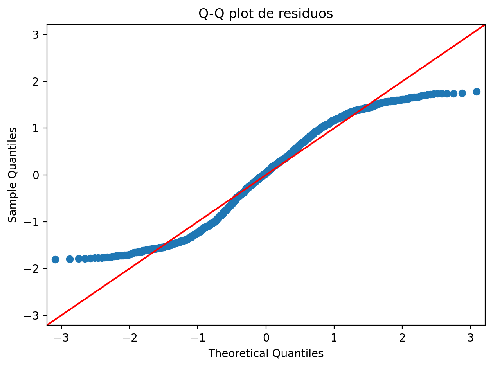
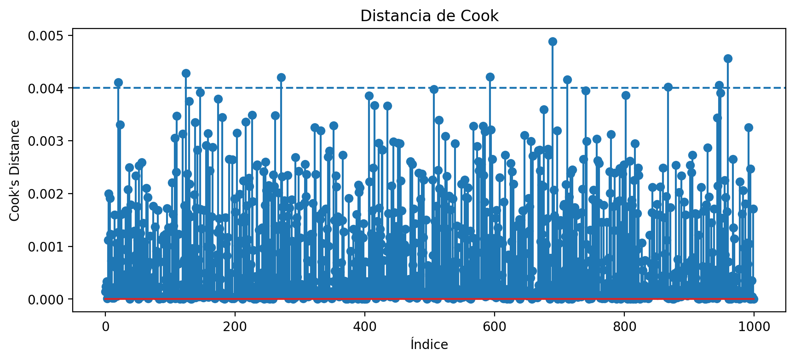
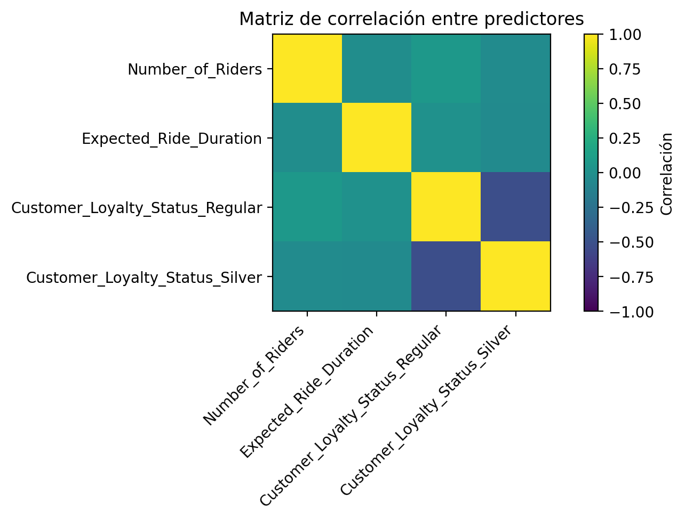

# Dynamic Pricing Analysis in Transportation Services

This project explores the relationship between operational and customer-related variables and the **average ratings** of trips in a ride-hailing service operating under a dynamic pricing model.

Through inferential statistics and multiple linear regression, the study evaluates whether variables such as the number of riders, expected ride duration, and customer loyalty status significantly affect average customer ratings.

- **Dataset**: `Dataset_dynamic_pricing.csv` — 1,000 observations, 10 variables
- **Language**: Python (Google Colab)
- **Course**: Statistical Methods in Data Science — UNAD, 2026

---

## Dataset

| Variable | Role |
|---|---|
| `Average_Ratings` | Dependent variable (target) |
| `Number_of_Riders` | Independent variable |
| `Expected_Ride_Duration` | Independent variable |
| `Customer_Loyalty_Status` | Categorical: Gold / Silver / Regular |
| `Vehicle_Type` | Categorical: Economy / Premium |

---

## Part 1 — Inferential Statistics

**Objective:** Apply inferential techniques to understand how operational variables behave across customer segments and whether meaningful differences exist between groups.

### 1. Central Limit Theorem (CLT)

1,000 samples of size n=30 were drawn from `Expected_Ride_Duration` to build the sampling distribution of the mean. Normality was verified with a Q-Q plot and Shapiro-Wilk test (p > 0.05), empirically confirming the CLT and validating the use of normal-distribution-based inference.

<p align="center">
  
</p>

<p align="center">
  
</p>

---

### 2. 95% Confidence Intervals

Three confidence intervals were constructed:

| Parameter | Method | Interval | Interpretation |
|---|---|---|---|
| Mean of `Expected_Ride_Duration` | t-Student | [96.54, 102.64] min | Average trip duration is close to 100 minutes |
| Proportion of excellent ratings (≥ 4) | Z normal | [65.7%, 71.5%] | ~7 out of 10 trips are well rated; the 70% target is at the upper bound |
| Variance of `Expected_Ride_Duration` | Chi-squared | [2,218, 2,644] min² | High variance reflects very heterogeneous trip durations |

<p align="center">
  
</p>

---

### 3. Hypothesis Tests

#### Welch T-Test — Duration by Loyalty Group

Compared average duration between Gold (mean = 101.6 min) and Silver (mean = 97.0 min) customers.

| Statistic | Value |
|---|---|
| t | 1.21 |
| p-value | 0.226 |
| Decision | Fail to reject H₀ |

No significant difference was found. Loyalty level is not associated with longer or shorter trips.

<p align="center">
  
</p>

#### Z-Test for Proportions — Ratings by Vehicle Type

Compared the proportion of excellent ratings (≥ 4) between Economy (69.7%) and Premium (67.6%) vehicles.

| Statistic | Value |
|---|---|
| z | 0.69 |
| p-value | 0.487 |
| Decision | Fail to reject H₀ |

Customer satisfaction is statistically equal regardless of vehicle type.

#### Fisher F-Test — Variance Equality

Compared duration variance between Gold and Silver loyalty groups.

| Statistic | Value |
|---|---|
| F | 1.085 |
| p-value | 0.451 |
| Decision | Fail to reject H₀ |

Variance in trip duration is similar across both loyalty segments.

#### Chi-Squared Independence Test

Tested independence between `Customer_Loyalty_Status` and `Vehicle_Type`.

| Statistic | Value |
|---|---|
| χ² | 1.49 |
| p-value | 0.474 |
| Decision | Fail to reject H₀ |

The two variables are independent: vehicle type chosen does not depend on loyalty level.

---

### 4. Statistical Power

| Metric | Value |
|---|---|
| Cohen's d | 0.093 (very small effect) |
| Statistical power | 22.9% |

The low power implies a high probability of Type II error. Conclusions of group equality should be interpreted with caution in managerial decisions, as the sample may not be large enough to detect small real differences.

---

### Part 1 — Conclusions

- The CLT is empirically confirmed for the ride duration variable.
- None of the hypothesis tests detected significant differences or associations between the evaluated groups.
- The most operationally relevant finding is the **high variance in trip duration**, which complicates driver scheduling and the dynamic pricing model.

---

## Part 2 — Multiple Linear Regression

**Objective:** Evaluate whether operational variables can explain average customer ratings using an OLS multiple linear regression model.

### Model Specification

| Element | Detail |
|---|---|
| Dependent variable | `Average_Ratings` |
| Predictors | `Number_of_Riders`, `Expected_Ride_Duration`, `Customer_Loyalty_Status` (dummies; Gold = reference) |
| Method | OLS — statsmodels |

**Estimated equation:**

```
Average_Ratings = 4.2229
                + 0.0001 × Number_of_Riders
                − 0.0001 × Expected_Ride_Duration
                + 0.0364 × (Regular vs Gold)
                + 0.0714 × (Silver vs Gold)
```

---

### Coefficients

| Variable | β | p-value | Significant |
|---|---|---|---|
| Intercept | 4.2229 | < 0.001 | Yes |
| Number_of_Riders | 0.000150 | 0.798 | No |
| Expected_Ride_Duration | −0.000126 | 0.653 | No |
| Loyalty_Regular | 0.036439 | 0.294 | No |
| **Loyalty_Silver** | **0.071388** | **0.034** | **Yes** |

- The intercept (4.22) represents the estimated average rating for a Gold customer with continuous predictors at zero.
- `Number_of_Riders` and `Expected_Ride_Duration` have virtually zero effect on ratings.
- Silver customers rate ~0.07 points higher than Gold — the **only statistically significant predictor**.

---

### Goodness of Fit

| Metric | Value | Interpretation |
|---|---|---|
| R² | 0.0049 | Model explains only 0.49% of variance in ratings |
| Adjusted R² | 0.0009 | Practically zero |
| F p-value | 0.299 | Global model is NOT significant |
| RSE | 0.4356 | Average prediction error ≈ ±0.44 points |

The model has virtually no explanatory power. The selected variables do not determine customer ratings.

---

### Assumption Diagnostics

#### Residual Analysis

<p align="center">
  
</p>

<p align="center">
  
  
</p>

| Assumption | Test | Result | Status |
|---|---|---|---|
| Normality | Shapiro-Wilk | p << 0.05 | **Not met** — residuals are non-normal |
| Homoscedasticity | Breusch-Pagan | LM = 9.871, p = 0.043 | **Marginal heteroscedasticity detected** |
| Autocorrelation | Durbin-Watson | DW = 1.999 | Met (safe range: 1.5–2.5) |
| Multicollinearity | VIF | Low — independent dummies | Met |

The non-normality has limited practical impact given n = 1,000 (CLT applies). The heteroscedasticity makes OLS standard errors slightly unreliable but is confirmed as marginal.

#### Outlier Detection

<p align="center">
  
</p>

Cook's distance confirmed no observations exert disproportionate leverage on the model estimates.

---

### Correlation Matrix

<p align="center">
  
</p>

---

### Model Improvement Attempts

| Approach | R² | Breusch-Pagan p | Result |
|---|---|---|---|
| OLS (original) | 0.0049 | 0.043 | Baseline |
| Log transformation (log Y) | 0.0047 | 0.066 | Heteroscedasticity resolved; R² unchanged |
| Box-Cox (λ = 1.225) | 0.0049 | 0.039 | No improvement; λ ≈ 1 confirms original scale is near-optimal |
| Robust RLM (Huber) | — | — | Coefficients virtually identical to OLS; Silver remains significant (p = 0.035) |

#### Bootstrap Confidence Intervals (1,000 resamples, 95% percentile)

| Variable | β | IC 2.5% | IC 97.5% | Excludes zero |
|---|---|---|---|---|
| Intercept | 4.2229 | 4.1229 | 4.3277 | Yes |
| Number_of_Riders | 0.000150 | −0.001076 | 0.001343 | No |
| Expected_Ride_Duration | −0.000126 | −0.000665 | 0.000420 | No |
| Loyalty_Regular | 0.036439 | −0.031672 | 0.103953 | No |
| **Loyalty_Silver** | **0.071388** | **0.004013** | **0.136675** | **Yes** |

The bootstrap (no normality assumption) confirms that only the Silver effect is robust: its CI does not include zero.

---

### Part 2 — Conclusions

- The regression model does not explain `Average_Ratings` with the available variables: R² ≈ 0 and the global F-test is not significant (p = 0.299).
- The only robust effect — confirmed by OLS, RLM, and Bootstrap — is that **Silver customers rate ~0.07 points higher than Gold**, though the effect size is very small.
- The assumptions of normality and homoscedasticity are not fully met, but robust methods and bootstrap align with OLS, lending confidence to the conclusions.
- Average ratings are determined by factors not captured in the dataset: driver behavior, punctuality, vehicle condition, etc.
- Improving the model would require variables directly related to the user's in-ride experience.

---

## Tools and Technologies

- Python 3 (Google Colab)
- `pandas` · `numpy` · `scipy` · `statsmodels`
- `matplotlib` · `seaborn`
- Jupyter Notebook

---

## Author

**María Virginia Gómez Sandoval**  
Data Science · 2026
